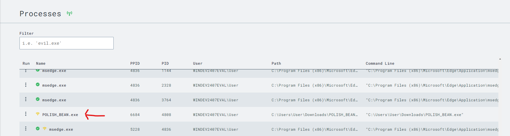

# SOC Home Lab

## Objective
My SOC Home Lab was created to gain more practical skills in SOC Operations. I will do this by simulating a real cyber attack on a Victim machine (Windows 11), using Slivers C2 Payload generator on an Ubuntu machine. Then I will view the logs of the EDR using the built-in SIEM. Finally, I will hunt for malicious traffic and then create rules to detect, block, and prevent future attacks.

### Skills Learned/Trained

- Creating and configuring an EDR solution on a machine.
- Using a SIEM to ingest logs from EDR.
- Detection Engineering/Tuning false positives.
- Creating custom EDR rules to detect malicious activity.
- Threat Emulation/Purple teaming.
  
### Tools Used

- LIMACharlie EDR / SIEM 
- Sliver C2 payload generator for creating telemetry on our victim machine.
- VMware Workstation to host our virtual network and machines.
- Sysmon to monitor the machine since LimaCharlie is a lightweight EDR solution.

## Steps
First We need to set up the virtual machines, On the Windows machine I will be disabling Windows Defender aswell as installing the EDR sensor aswell as Sysmon. Next, I will configure an Ubuntu machine with a static IP and install the sliver C2 payload generator.

### Windows

Remove Windows Defender Regedit in safe mode and GPMMC 

Install the LimaCharlie Agent. 

Create a Artifact rule so that Sysmon will send to our SIEM on LimaCharlie. 

### Ubuntu

Check IP information for ssh connection.

SSH in and then download the sliver C2 Payload generator. 

Next, we will generate a payload and download it on the victim machine so that we can create telemetry.

Download the Created C2 Payload

Creating the Python3 HTTP server

Run the C2 exe on the victim machine (POLISH_BEAN) and check sessions we can use the "use" command to connect through the reverse shell similar to Metasploit.

Running some commands to create some telemetry
 

Looking into the EDR solution (LimaCharlie) To view running processes and find POLISH_BEAN C2

Here we can see the network connections created by the process POLISH_BEAN trying to reach out to our linux machine/C2 Server @192.168.182.128 

Exploitation- 
Dump lsass from memory to server 

EDR Detection 

Create our own custom rule to detect if lsass is being accessed

Matched event in the test case.

Now under the detections tab, we can see our custom detection rule for LSASS access.

LimaCharlie is a very powerful EDR and SIEM tool that's free to use, We can view the active network connections and ingest logs from different sources. 

