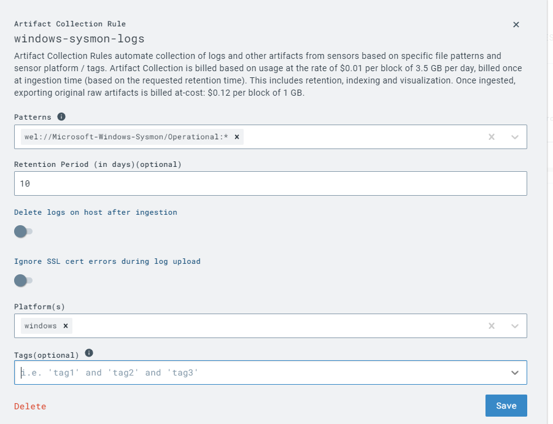

# SOC Home Lab

## Objective
My SOC Home Lab was created to gain more practical skills in SOC Operations. I will do this by simulating a real cyber attack on a Victim machine (Windows 11), using Slivers C2 Payload generator on an Ubuntu machine. Then I will view the logs of the EDR using the built-in SIEM. Finally, I will hunt for malicious traffic and then create rules to detect, block, and prevent future attacks.

### Skills Learned/Trained

- Creating and configuring an EDR solution on a machine.
- Using a SIEM to ingest logs from EDR.
- Detection Engineering/Tuning false positives.
- Creating custom EDR rules to detect malicious activity.
- Threat Emulation/Purple teaming.
  
### Tools Used

- LIMACharlie EDR / SIEM 
- Sliver C2 payload generator for creating telemetry on our victim machine.
- VMware Workstation to host our virtual network and machines.
- Sysmon to monitor the machine since LimaCharlie is a lightweight EDR solution.

## Steps
First We need to set up the virtual machines, On the Windows machine I will be disabling Windows Defender aswell as installing the EDR sensor aswell as Sysmon. Next, I will configure an Ubuntu machine with a static IP and install the sliver C2 payload generator.

###Windows

###Ubuntu

Next, we will generate a payload and download it on the victim machine so that we can create telemetry.
